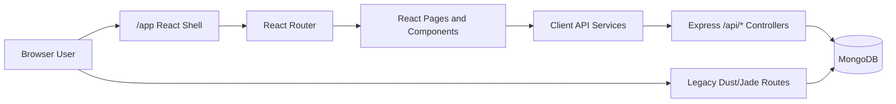

# React Migration Architecture

```mermaid
flowchart LR
  User[Browser User]
  AppShell["/app React Shell"]
  Router[React Router]
  Pages[React Pages and Components]
  ApiClient[Client API Services]
  ApiRoutes["Express /api/* Controllers"]
  LegacyRoutes[Legacy Dust/Jade Routes]
  Data[(MongoDB)]

  User --> AppShell --> Router --> Pages --> ApiClient --> ApiRoutes --> Data
  User --> LegacyRoutes --> Data
```
